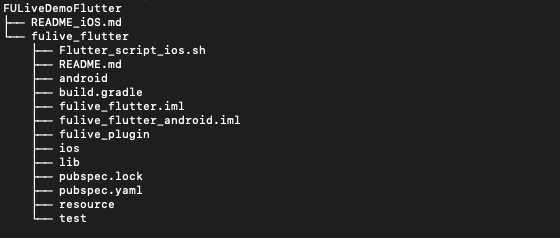
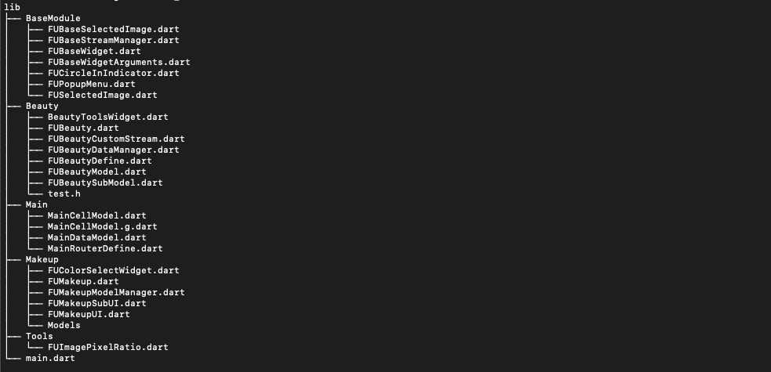
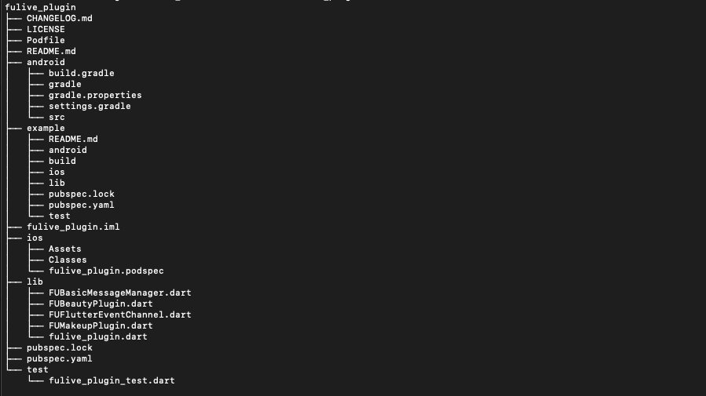

# 前言

### 开发Flutter 版本时的一些 开发环境版本

### Flutter 环境: 2.13.3, 支持 null safty

### Cocoapods 版本:1.10.2

### Xcode  版本 ：>= 12.4

# 整体目录结构介绍 

## FULiveDemoFlutter 工程壳根目录

### fulive_flutter: Flutter 工程的根目录

#### build: 编译产物

#### fulive_plugin: native 通信的插件目录

#### ios:  在ios平台上运行Flutter 代码的壳工程

#### android：在android 平台上运行的Flutter 代码壳工程

#### lib: Flutter 主要代码

#### resource: 资源文件 

#### pubspec.lock：了解过cocoapod都知道，锁定当前pub依赖对应的版本文件，类似 podFile.lock作用

#### pubspec.yaml: Flutter 依赖文件

#### Flutter_script_iOS.sh 脚本初始化Flutter 处理Flutter 项目运行的环境目前只针对iOS平台

----

### lib:  dart 模块根目录

#### BaseModule :  页面基础模块构成

#### Beauty: 美颜模块

#### Main: app 启动的主页面

#### Makeup: 美妆模块

#### Tools: 工具类

#### main.dart: native 调用Flutter 的入口模块

----

### fulive_plugin: 插件根目录

#### Android： android native 插件代码

#### ios: iOS native 插件代码

#### lib:  连接 dart 和 对应的naitve 平台插件的中间层或者理解为 平台插件接口层

#### pubspec.lock 和 pubspec.yaml 前面已经解释过

----

## 项目怎样跑起来(iOS 篇)

### 本人习惯用VSCode，这里介绍VSCode run项目

#### 1. 直接将fulive_flutter 拖进vscode

#### 2. 在VSCode 终端(vscode 已经帮我们定位到fulive_flutter根目录)执行 sh Flutter_script_ios.sh 即可初始化Flutter环境以及iOS 所需要的pod 环境。具体过程Flutter_script_ios.sh 脚本写的很清楚。

#### 3. 用VSCode 调试 Flutter 代码直接 配置好对应的debug配置即可(不会可自行百度，这里就不介绍了，超纲了)。

#### 4. 不出意VSCode 会提示证书相关错误，去  fulive_flutter/ios 目录下 打开workSpace 配置一下对应的证书即可。

#### 5. 不调试Flutter 代码也可以直接进入 fulive_flutter/ios  目录下 打开workSpace，直接 run 就可以运行（别忘记配置证书）。

----

# 杂项

## Flutter 介入native 工程全部采用Cocoapods 方式

## Flutter attach 在iOS 使用

### 1. iOS 14.0 以上 需要配置infPlist : https://flutter.dev/docs/development/add-to-app/ios/project-setup#local-network-privacy-permissions， 

#### 考虑到墙的原因这里写下完整的配置步骤

#### 1.在 iOS 目录下把infop.plist 拷贝两份分别叫info-Debug.plist 和 info-Release.plist

#### 2. info-Debug.plist 增加 key NSBonjourServices  设置 value (是个数组) 字符串值为`_dartobservatory._tcp`

#### 3. 在BuildSetting 下 搜索INFOPLIST_FILE 设置路径参数: path/Info-$(CONFIGURATION).plist.  CONFIGURATION 会自动匹配当前运行模式(debug, release)

#### 4. Build Phases (BuildSetting右边)-> Copy Bundle Resource -> 搜索 info-release.plist 如果存在 干掉他！

#### 5. 配置完成，本质就是为了 让Flutter 开启本地服务监听，链接到 xcode 运行的真机上面，进行动态调试(个人推测)。

### 2. Xcode 先运行起来， 然后终端 输入 flutter attach， 等待接入成功， 实际调试发现顺序一定不要颠倒，否则会出问题。

###   3. 直接复制粘贴 终端的打印信息 的url 到google 浏览器(首先打开safair发现不行)。 然后就可以在浏览器看到debug信息以及断点调试dart代码！！

The Flutter DevTools debugger and profiler on lsh726-xiangxin is available at:

[http://127.0.0.1:9101?uri=http%3A%2F%2F127.0.0.1%3A51180%2FzE8VWLgomzI%3D%2F](http://127.0.0.1:9101/?uri=http%3A%2F%2F127.0.0.1%3A51180%2FzE8VWLgomzI%3D%2F)

----

## iOS plugin (fulive_plugin)： fulive_plugin/ios/fulive_plugin.podspec

#### 后续在iOS 插件工程上开发如需增加对应的native 依赖库，可以直接在fulive_plugin.podspec里面添加 s.dependency项，具体可以去fulive_plugin.podspec查看。

